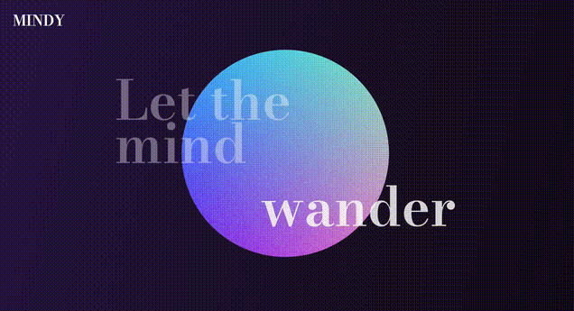
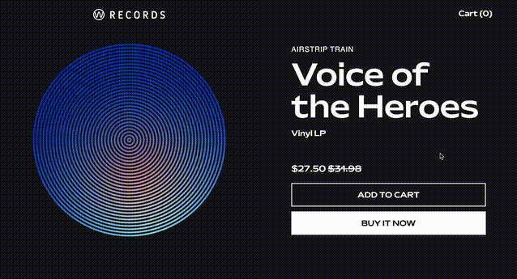
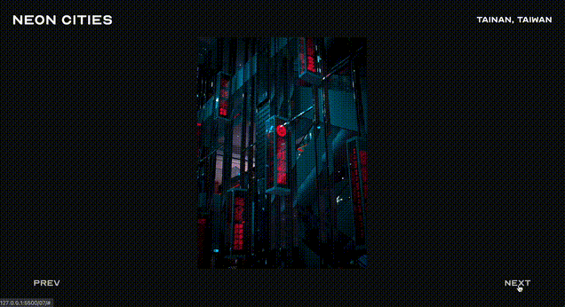

# Learn Shaders

### 01 Mindy




### 02 Kaleidoscope


### 03 Dreamy Texture


### 04 Gnosticism


```glsl
// Find out the aspect ratios
// texture_ratio: manualy get from image size (width / height)
float texture_ratio = 1200.0 / 1800.0; 
float canvas_ratio = resolution.x / resolution.y;

// Function
// Keeping the aspect ratio anchored to the center
vec2 aspect(vec2 uv, float texture_ratio, float canvas_ratio) {
    
    if (texture_ratio > canvas_ratio) {

        // if canvas is too portrait for the texture, stretch across
        float diff = canvas_ratio / texture_ratio;
        uv.x *= diff;
        uv.x += (1.0 - diff) / 2.0;

    } else {

        // else canvas too landscape for the texture, stretch down 
        float diff = texture_ratio / canvas_ratio;
        uv.y *= diff;
        uv.y += (1.0 - diff) / 2.0;

    };
    
    return uv;
}
```

### 06 W Records



### 07 Neon Cities




## Credits
- Images from [Unsplash](https://unsplash.com/)